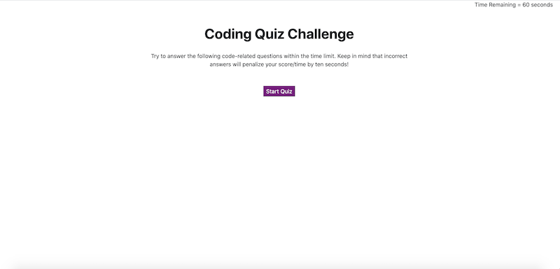

# Code-quiz website project

## Description 

During their careers web developers are often asked to complete coding assessments which typically include multiple-choice questions along with some interactive challenges.  In this project we were asked to create a basic version of such a quiz consisting of a series of multiple-choice questions, along with a scoring metric that measures the speed in which they are correctly answered.  The final score corresponds to the time remaining on the clock when complete so the fastest completion times result in the highest scores.  Any incorrect answers submitted along the way result in a 10-second penalty.  

We were instructed to present the user with an intro screen outlining the parameters of the quiz and a "start button" which generated the first question and started the clock countdown.  The clock was set at 60 seconds.

The user is presented with four possible answers to each question and is alerted as to whether the answer is correct or not.  The next question is not presented until the question is answered correctly.

The game ends either when all questions are answered correctly, or when the timer reaches zero.  If the user is able to complete the quiz before the timer reaches zero, they are prompted to enter their initials.  Their initials and score are then placed into local storage.

A great lesson learned in developing this project was the importance of good pseudocoding.  Upon reflection I did not properly think this through because though I did outline the steps I did not think in terms of the "DRY" concept.  I took each section one by one and basically hard-coded them.  By the time I reached question 3 I realized my error and that I should have built arrays and loops with the various questions and answers but by that stage there was too much time invested to turn back.

I had difficulty putting the user's initials and scores into local storage in a format that could be retrievable for a "high scores" presentation.  However because this was not included with the read me I did not try to incorporate this feature beyond making sure that data was indeed placed into local storage.

### URL and Screen Shot

The URL for this website is https://7j647.github.io/code-quiz/

### Credits

With thanks to Coach Jonathan and his team and to Josh Furlin who assisted in a tudor session.  Also thank you to Stanley Lewis for spending so much time with me on the local storage issues I was having.

#### License

Copyright (c) [2020] [Jeff Flynn]

Permission is hereby granted, free of charge, to any person obtaining a copy
of this software and associated documentation files (the "Software"), to deal
in the Software without restriction, including without limitation the rights
to use, copy, modify, merge, publish, distribute, sublicense, and/or sell
copies of the Software, and to permit persons to whom the Software is
furnished to do so, subject to the following conditions:

The above copyright notice and this permission notice shall be included in all
copies or substantial portions of the Software.

THE SOFTWARE IS PROVIDED "AS IS", WITHOUT WARRANTY OF ANY KIND, EXPRESS OR
IMPLIED, INCLUDING BUT NOT LIMITED TO THE WARRANTIES OF MERCHANTABILITY,
FITNESS FOR A PARTICULAR PURPOSE AND NONINFRINGEMENT. IN NO EVENT SHALL THE
AUTHORS OR COPYRIGHT HOLDERS BE LIABLE FOR ANY CLAIM, DAMAGES OR OTHER
LIABILITY, WHETHER IN AN ACTION OF CONTRACT, TORT OR OTHERWISE, ARISING FROM,
OUT OF OR IN CONNECTION WITH THE SOFTWARE OR THE USE OR OTHER DEALINGS IN THE
SOFTWARE.

---

##### Badges

###### Contributing

For other developers who would like to improve the work done on this project or offer suggestions, please feel free to do so and Slack me with your comments.

